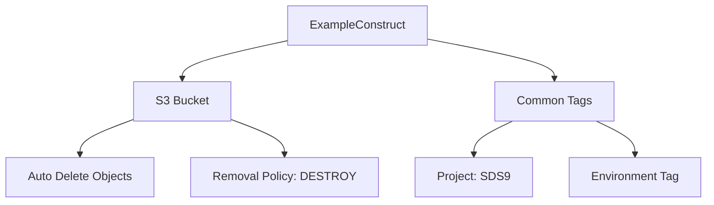
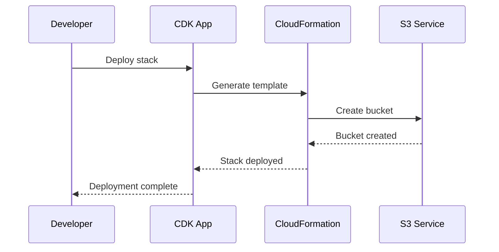

# Class: ExampleConstruct

Defined in: [constructs/example-construct.ts:61](https://github.com/sds9/mono/blob/344628fa523bb44a3f881ed6d46b38ad07cac175/cdk/src/constructs/example-construct.ts#L61)

Example CDK construct for SDS9 Organization

This construct demonstrates how to create reusable AWS infrastructure components
using the AWS CDK with TypeScript.

## Architecture



## Resource Flow



## Example

```typescript
const exampleConstruct = new ExampleConstruct(this, 'MyExample', {
  namePrefix: 'my-app',
  environment: 'production'
});
```

## Extends

- `Construct`

## Constructors

### Constructor

> **new ExampleConstruct**(`scope`, `id`, `props`): `ExampleConstruct`

Defined in: [constructs/example-construct.ts:62](https://github.com/sds9/mono/blob/344628fa523bb44a3f881ed6d46b38ad07cac175/cdk/src/constructs/example-construct.ts#L62)

#### Parameters

##### scope

`Construct`

##### id

`string`

##### props

[`ExampleConstructProps`](../interfaces/ExampleConstructProps.md)

#### Returns

`ExampleConstruct`

#### Overrides

`Construct.constructor`
