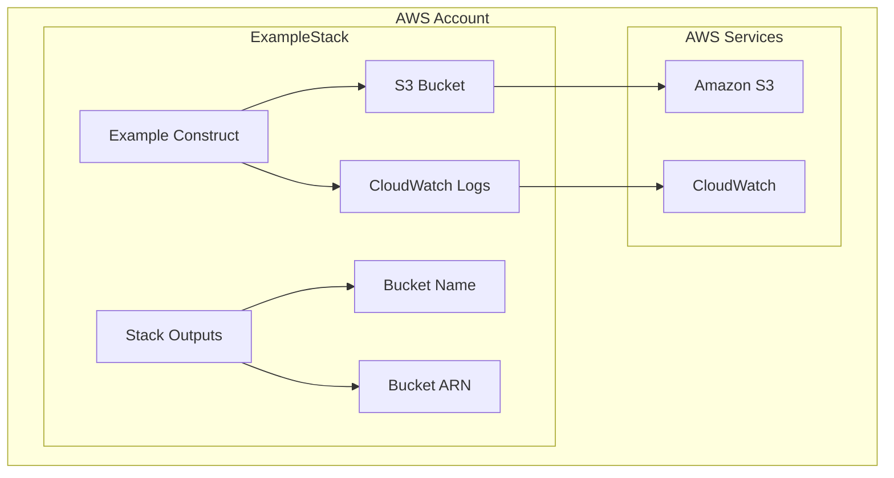
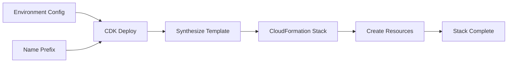

# Class: ExampleStack

Defined in: [stacks/example-stack.ts:64](https://github.com/sds9/mono/blob/024ca2887091d956c01ca2abca97dc9e147722e2/cdk/src/stacks/example-stack.ts#L64)

Example CDK stack for SDS9 Organization

This stack demonstrates how to compose multiple constructs into a deployable unit.

## Stack Architecture



## Deployment Process



## Example

```typescript
const stack = new ExampleStack(app, 'MyExampleStack', {
  env: { account: '123456789012', region: 'us-east-1' },
  environment: 'production',
  namePrefix: 'my-app'
});
```

## Extends

- `Stack`

## Constructors

### Constructor

> **new ExampleStack**(`scope`, `id`, `props`): `ExampleStack`

Defined in: [stacks/example-stack.ts:65](https://github.com/sds9/mono/blob/024ca2887091d956c01ca2abca97dc9e147722e2/cdk/src/stacks/example-stack.ts#L65)

#### Parameters

##### scope

`Construct`

##### id

`string`

##### props

[`ExampleStackProps`](../interfaces/ExampleStackProps.md)

#### Returns

`ExampleStack`

#### Overrides

`cdk.Stack.constructor`
