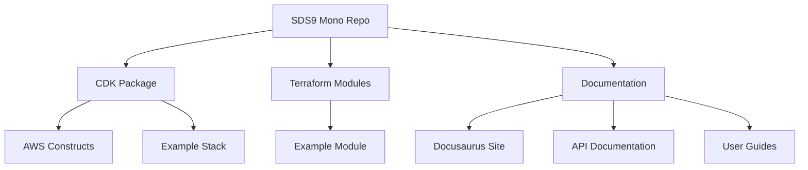
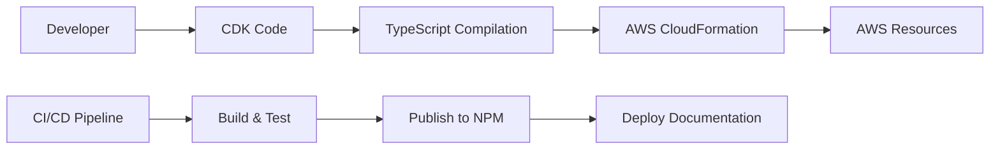
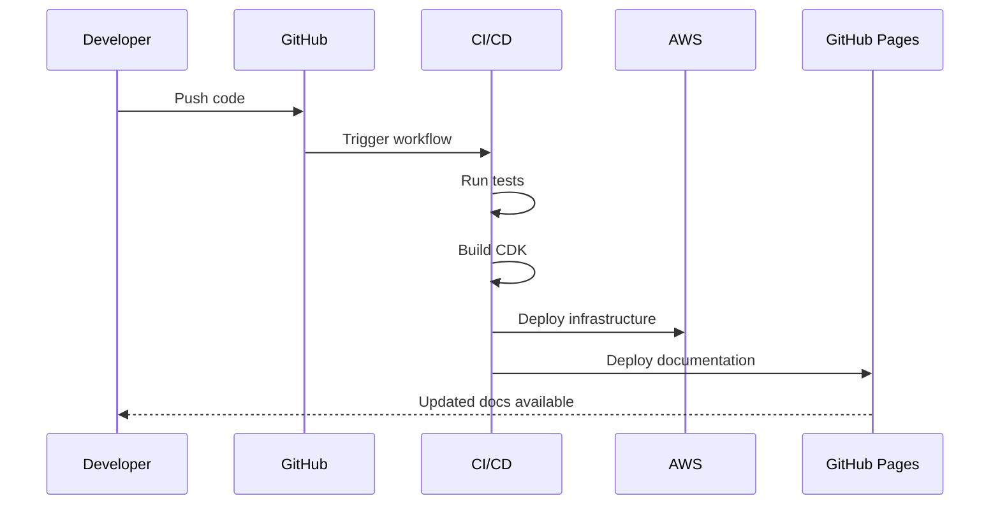
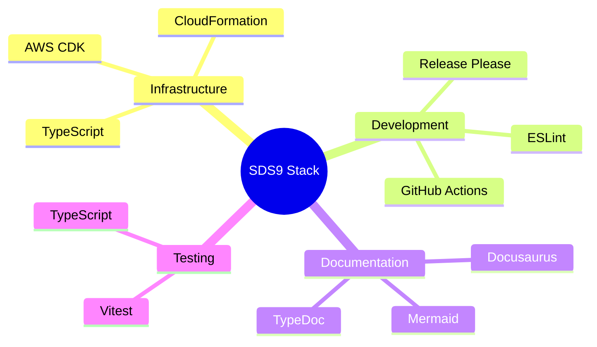

# Architecture Overview

This page demonstrates the architecture of our SDS9 Organization monorepo and shows how to use Mermaid diagrams in Docusaurus.

## Repository Structure

## CDK Architecture Flow

## Deployment Pipeline

## Technology Stack

## API Documentation

The API documentation is automatically generated from TypeScript code using TypeDoc and integrated into this Docusaurus site. You can find it in the [API Reference section](/docs/api/).

## Getting Started

1. Clone the repository
2. Install dependencies: `npm install`
3. Build the project: `npm run build`
4. Run tests: `npm test`
5. Start the docs locally: `npm run start --workspace=docs`

For more detailed information, check out the [tutorial section](/docs/intro).
